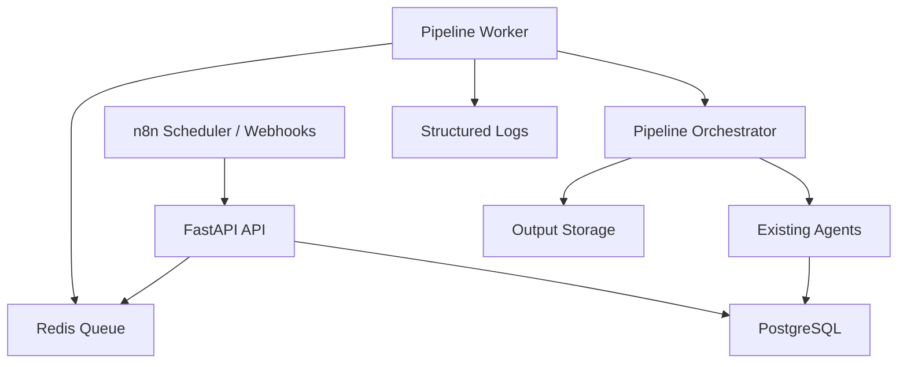

# Production Foundation Design

## Purpose

This project is an AI YouTube Growth Platform. Its purpose is to help build and operate a YouTube channel toward monetization by producing original, high-quality, policy-aware videos and learning from channel performance over time.

The first production milestone is not a dashboard or a fully autonomous channel manager. The first milestone is a reliable backend foundation: the API must enqueue jobs, a worker must process them, job state must be visible, failures must be diagnosable, and the core pipeline contracts must be stable enough to support future growth agents.

## Product Goal

Phase 1 turns the current prototype into a production-ready backend foundation for a YouTube automation system.

The system should:

- Accept pipeline jobs through the FastAPI API.
- Process jobs in a dedicated worker service.
- Track job lifecycle states clearly.
- Retry transient failures and preserve final failure details.
- Stabilize data contracts between pipeline steps.
- Run API and worker as separate Docker Compose services.
- Provide focused automated tests around the foundation.

This phase deliberately avoids building the full self-learning loop, dashboard, autonomous upload approval, or multi-channel SaaS features.

## Current State

The repository already has the main pieces:

- `api/main.py`: FastAPI API with health, pipeline start, channel analysis, and stats endpoints.
- `core/queue.py`: Redis-backed queue helpers with enqueue, dequeue, and status functions.
- `agents/pipeline.py`: pipeline orchestrator for topic, research, fact-check, script, images, music, render, shorts, thumbnail, and upload.
- `agents/*_agent.py`: specialized AI and media agents.
- `db/schema.sql`: PostgreSQL schema for topics, scripts, assets, videos, shorts, analytics, API usage, and pipeline logs.
- `docker-compose.yml`: PostgreSQL, Redis, n8n, and API services.
- `video_engine/`: Remotion video rendering engine.

The gaps that block production use:

- API enqueues pipeline jobs, but there is no dedicated worker service consuming them.
- Queue status only stores a simple string, so errors, attempts, and timestamps are lost.
- `Pipeline.run_full()` expects `video["id"]`, while `VideoAgent.run()` returns `video_id`.
- Docker Compose starts the API, but not a worker.
- Tests are missing for queue behavior, job handling, and pipeline contracts.
- Environment defaults can hide missing configuration.

## Architecture

Phase 1 keeps the existing architecture and makes the boundaries explicit.



Responsibilities:

- FastAPI accepts requests, validates payloads, enqueues jobs, and exposes health/status endpoints.
- Redis holds pending jobs and job metadata.
- Worker owns job execution, retry, and final status transitions.
- Pipeline orchestrates domain steps and writes pipeline logs.
- Agents perform specific domain work.
- PostgreSQL remains the system of record for channel/video/pipeline data.
- n8n remains an external workflow trigger and notification layer, not the core business logic layer.

## Job Model

The queue should use a structured job envelope:

```json
{
  "job_id": "uuid",
  "queue": "pipeline",
  "action": "run_pipeline",
  "data": {
    "category": "science",
    "language": "vi",
    "count": 1
  },
  "attempt": 0,
  "max_attempts": 3,
  "created_at": "2026-06-26T00:00:00+00:00"
}
```

Job metadata should be stored separately under a Redis hash keyed by job ID. The metadata should include:

- `status`: `queued`, `processing`, `completed`, or `failed`.
- `queue`: queue name.
- `action`: action name.
- `attempt`: current attempt number.
- `max_attempts`: retry limit.
- `created_at`: enqueue timestamp.
- `started_at`: latest processing timestamp.
- `completed_at`: completion timestamp.
- `failed_at`: final failure timestamp.
- `error`: short final error message.

For Phase 1, one worker process is enough. The design should still avoid assumptions that prevent multiple workers later.

## Worker Behavior

Create a dedicated worker entry point responsible for:

1. Initializing shared resources.
2. Blocking on the `pipeline` queue.
3. Marking jobs as `processing`.
4. Dispatching supported actions.
5. Updating status to `completed` on success.
6. Retrying failures while attempts remain.
7. Marking jobs `failed` after the final attempt.
8. Logging every state transition with `job_id`, `action`, `category`, and `language`.
9. Handling shutdown signals gracefully.

Supported Phase 1 action:

- `run_pipeline`: calls `Pipeline.run_full(category=..., language=...)`.

The current API payload uses `action: "generate_topics"`. Phase 1 should normalize this to `run_pipeline` because the endpoint starts the full pipeline, not only topic generation.

## API Behavior

Keep existing behavior where practical and add job visibility.

Endpoints:

- `POST /api/pipeline/start`
  - Enqueues one or more `run_pipeline` jobs.
  - Returns a primary `job_id` for compatibility when `count = 1`.
  - If `count > 1`, returns all job IDs or a batch-style response.

- `GET /api/jobs/{job_id}`
  - Returns Redis job metadata.
  - Returns `404` for unknown job IDs.

- `GET /api/stats`
  - Keeps existing fields.
  - Adds queue/job counts where cheap to compute, such as pending pipeline jobs.

The API should not execute long-running pipeline work inside request handlers.

## Pipeline Contract Stabilization

The pipeline and agents should agree on stable return shapes.

For Phase 1, avoid a broad rewrite of every agent. Focus on the broken and high-risk contracts:

- `VideoAgent.run()` result must expose an `id` field or `Pipeline.run_full()` must read `video_id`.
- The chosen contract should be explicit and covered by a test.
- `Pipeline.run_full()` should return a predictable dict containing:
  - `topic`
  - `video`
  - `upload_result`
  - `shorts`
  - `elapsed_seconds`

Recommended Phase 1 decision:

- Preserve `video_id` for backward compatibility.
- Also include `id` in `VideoAgent.run()` result so the result matches the `videos` table primary key convention used by the pipeline.

This is the smallest safe change and avoids a broader rename across the codebase.

## Queue Reliability

Phase 1 retry rules:

- Default `max_attempts = 3`.
- Any unhandled exception from a job counts as a failed attempt.
- If attempts remain, the worker re-enqueues the job with `attempt + 1`.
- If attempts are exhausted, status becomes `failed`.
- Store a short `error` string for final failure.

Do not add complex delayed backoff or distributed locking yet. If a backoff is needed, use a small fixed async sleep before re-enqueueing inside the worker. This keeps behavior simple and testable.

Dead-letter behavior:

- Phase 1 can represent dead-letter as `status = failed` plus retained metadata.
- A separate Redis `queue:pipeline:failed` list may be added if it stays simple.

## Configuration

Configuration should fail early for production-critical values while remaining testable.

Add validation paths for:

- `DATABASE_URL`
- `REDIS_URL`
- AI API keys when AI-backed agents are actually invoked.
- YouTube credentials only when upload functionality is invoked.

Avoid making local tests require real AI or YouTube credentials.

Existing defaults like `sk-CHANGE_ME` should not silently pass production validation.

## Docker Compose

Docker Compose should run API and worker separately:

- `api`: FastAPI only.
- `worker`: Python worker entry point.
- `postgres`: unchanged.
- `redis`: unchanged.
- `n8n`: unchanged and optional for core backend operation.

The worker should share the same image as the API but use a different command.

## Testing Strategy

Add focused tests around the production foundation.

Required test groups:

- Queue tests:
  - enqueue creates a structured envelope.
  - job metadata starts as `queued`.
  - status lookup returns useful metadata.

- Worker tests:
  - worker dispatches a fake `run_pipeline` job.
  - success marks job `completed`.
  - exception retries while attempts remain.
  - final exception marks job `failed`.

- Pipeline contract tests:
  - video result exposes both `id` and `video_id`.
  - pipeline reads the correct video ID.

- API tests:
  - `POST /api/pipeline/start` enqueues a job.
  - `GET /api/jobs/{job_id}` returns job metadata.
  - unknown job ID returns 404.

Tests should mock Redis, DB, and pipeline execution where practical. Real Remotion rendering and real AI calls are out of scope for Phase 1 tests.

## Operational Logging

Logs should be structured enough to debug a production run.

Every worker log for a job should include:

- `job_id`
- `queue`
- `action`
- `attempt`
- `category`
- `language`

Pipeline logs already exist in PostgreSQL and should continue to be written by the pipeline/agents. Worker logs are for job-level execution and infrastructure diagnosis.

## Security And Safety Boundaries

Phase 1 keeps OpenClaw and Hermes out of the core system. They can be evaluated later as optional operators, but the trusted execution path should remain inside this codebase.

n8n should be used for scheduling, webhooks, notifications, and integration glue. It should not own the core content strategy, scoring, render, upload, or analytics logic.

Autonomous upload should remain controlled by the pipeline and should support a future human approval mode before publishing.

## Acceptance Criteria

Phase 1 is complete when:

- `POST /api/pipeline/start` creates a structured `run_pipeline` job.
- A dedicated worker service consumes and processes the job.
- Job status is visible through `GET /api/jobs/{job_id}`.
- Success and failure states are recorded with useful metadata.
- Failed jobs retry up to the configured attempt limit.
- The video result contract bug is fixed and tested.
- Docker Compose includes a worker service.
- Automated tests cover queue, worker, API status, and pipeline contract behavior.
- No test requires real AI API calls, YouTube upload, or Remotion rendering.

## Out Of Scope For Phase 1

- Dashboard UI.
- Full analytics learning loop.
- pgvector memory system.
- Advanced competitor monitoring.
- Thumbnail A/B testing.
- Autonomous monetization policy agent.
- Multi-channel SaaS features.
- OpenClaw or Hermes integration.
- Full Remotion render isolation.

## Next Phases

Phase 2: Video Quality Engine

- Topic scoring.
- Originality checker.
- Script doctor.
- Title and thumbnail lab.
- Better video quality evaluation before publishing.

Phase 3: Learning Loop

- YouTube Analytics ingestion.
- CTR, retention, watch hour, and subscriber gain analysis.
- Strategy feedback into topic/title/script/thumbnail generation.

Phase 4: Monetization Safety

- Policy risk checker.
- Copyright and reused-content risk checker.
- Human approval workflow before risky uploads.

Phase 5: Scale

- Multi-channel support.
- Content calendar.
- Dashboard.
- More advanced queue/backoff/dead-letter workflows.
